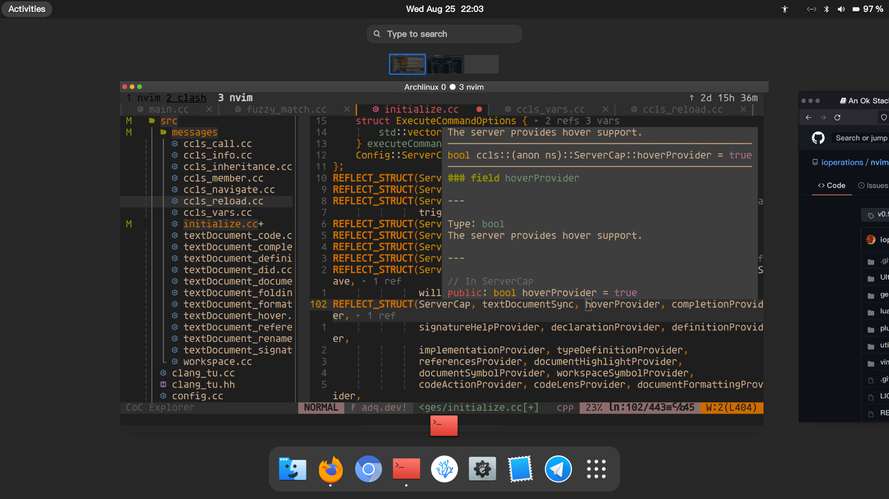

<!--  -->
 

- 👋 Hi, I’m @ioperations
- 👀 I’m interested in linux/c/c++/rust/llvm/
- 🌱 I’m currently learning linux kernel
- 💞️ I’m looking to collaborate on distributed computing system
- 📫 How to reach me ioperations.c@gmail.com
- 📕 I publish my blog via [ioperations.github.io](https://ioperations.github.io)

<!---
ioperations/ioperations is a ✨ special ✨ repository because its `README.md` (this file) appears on your GitHub profile.
You can click the Preview link to take a look at your changes.
--->
